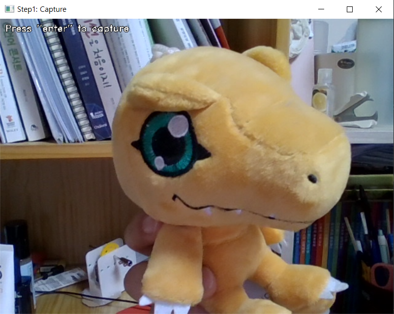
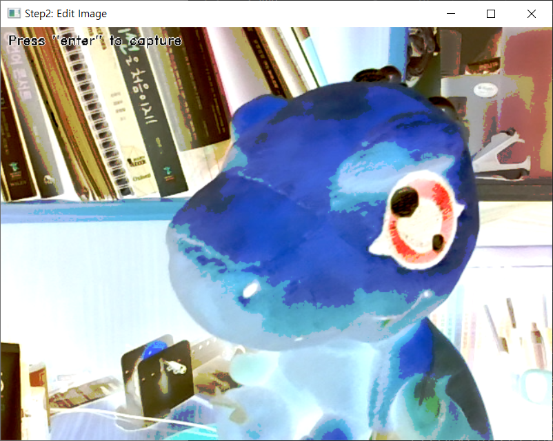

# mini_capture_and_modify_system
this is mini_capture_and_modify_system, you can capture and modify the image    
    
노트북에 설치된 웹캠으로 현재의 이미지를 캡쳐 후 밝기, 대조를 수정하거나 이미지 색 반전, 혹은 잘라내기(crop)를 할 수 있습니다.  
   
이 미니 캡처&수정 프로그램을 사용하기 위해서(작동하는 과정은) 크게 _두_ _가지의_ _과정_ 이 있습니다.   
      
## 1. 원하는 순간 캡쳐하기   
   
처음에 나타나는 화면에서 'Enter'키를 눌러서 원하는 순간 캡쳐를 할 수 있습니다. 이때 캡쳐한 이미지는 img 폴더에 **'captured_image.png'라는 파일로 저장**이 됩니다.   
   
## 2. 캡쳐한 이미지를 수정하기   
   
방금 캡쳐한 이미지를 마우스나 키보드를 통해서 특정 수정기능을 활용하실 수 있습니다.   
(위의 이미지는 대조, 밝기를 변경 한 후 색반전을 한 결과물입니다)   

1. 밝기 변경    
키보드의 **'['** , **']'**에 해당하는 키를 눌러서 밝기를 변경할 수 있습니다. '['키를 한번 눌러주면 꾸준히 밝기가 감소하고, ']'를 한번 눌러주면 꾸준히 밝기가 증가합니다. 이때 여러번 누를 수록 빠르게 밝기의 변화가 일어납니다.   
   
2. 대조 변경
밝기의 변경과 작동방식은 유사하며 키보드의 **'-'** , **'+'** 에 해당하는 키를 눌러서 대조를 변경할 수 있습니다.   

3. 색 반전   
키보드의 **'i'** 버튼을 눌러서 이미지의 색을 반전시킬 수 있습니다. 포토샵에서의 ctrl+i와 유사합니다.   

4. 이미지 자르기   
자르기 **원하는 구간의 왼쪽위 끝지점과 오른쪽 아래 끝지점을 연속으로 클릭**해주면 해당 범위 사각형 모양으로 이미지가 잘라져서 자동으로 저장이 됩니다. 혹시 처음 선택한 왼쪽위 끝지점이 잘못 클릭이 되었다면 키보드의 **'r'**키를 눌러서 선택을 초기화 할 수 있습니다.   
   
이렇게 수정된 이미지는 img 폴더에 **'edited_image.png'라는 파일로 저장**이 됩니다.   
   
   
(위의 결과물에서 이미지 자르기까지 하면 다음과 같은 파일이 최종 저장이 됩니다)   

[유튜브를 통해서 작동 전체 영상보기](https://youtu.be/X5AGYDIpELk)   